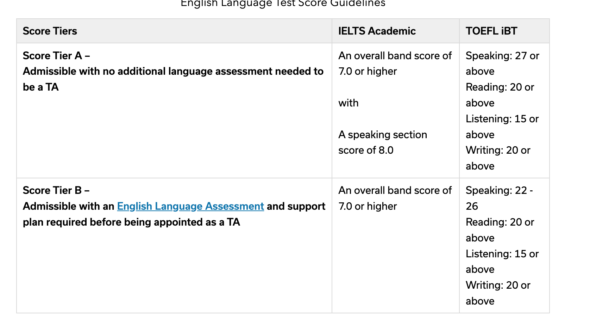

# 留学标化考试自学指南-WhileBug经验贴

## 背景简介
题主分别在2021年进行过两次IELTS笔试，两次GRE考试，一次TOEFL考试。然后在2024年又进行过三次IELTS考试。
题主最近的一次IELTS考试结果是7.5（听力7.5，阅读9.0，口语6.5，写作6.5）。
GRE考试结果是326+3.5。
TOEFL考试结果是92。

## 报不报机构？

第一个问题是要报机构还是要自学。以题主2024年考试的经历为例，实际上题主是连续三周考了三次考试。
第一次裸考6.5，第二次准备了一天6.5，第三次准备了一周7.5。

首先题主要用自身经历纠正下部分基础很好的同学的观念，即裸考也能过。
题主在头两次考试的时候对自身水平极其自信，因此搞出了两次裸考6.5的抽象操作（白花花的银子啊）。
然后第三次狠下心来准备了一周（实际是四天）的情况下，考出了7.5的成绩。
题主认为自己的英语整体水平没什么问题，但是英语应用和应试考试是两码事。

进一步的，题主回答大家报机构还是自学更好的问题。
首先题主四级考试成绩599，六级考试成绩540，高考138左右。各位SCUer可以看出来不是一个很高的分数（当然题主非常不重视四六级，基本完全裸考）。
以题主对各位SCUer的英语水平了解，题主的英语水平应该在SCU位于中上左右，不算特别好。大部分SCUer应该和我差不多甚至比我好。
并且雅思有较强的应试技巧特征（接下来题主会讲），在大家基础比较好的情况下，实际上是没必要去报雅思机构的（除非你基础实在太差了）。

## 雅思还是托福？

然后是选择雅思还是托福的问题。
题主最近正在申请PhD，身边很多朋友也正在申请PhD。
大家由于思维惯性，认为托福比雅思更好用实际上是一个误区（或者说半误区）。

就申请Master而言，美国确实有比较多的学校的program只接受托福成绩，但实际大部分也支持雅思。
而对于PhD而言，基本上雅思和托福都是支持的。
同时以上图的Cornell的雅思托福成绩要求为例，可以看到，实际上美国学校对于雅思的小分要求反倒没有托福卡的那么严。
如果你仔细读过很多学校的成绩要求，可以发现托福一大堆小分要求，但是雅思只有一个简单的"Overall 7.0"。

同时，由于雅思整体难度其实比托福第一档，所以个人认为理论上考雅思的性价比要稍微好点。

## 雅思考试经验分享

### 听力篇

题主2021年最后一次考试的听力是8.5（准备了一个月），2024年最后一次考试的听力是7.5（准备了四天）。
这里题主阐述一下听力的大致point：

- 注意定位词：开始前尽可能把定位词，定位词可能对应的同义词等想一下，根据定位词判断选择哪一个
- 听出错误选项的位置：选择题里面会有很多误导选项，这里题主有个策略，就是除了把正确选项给听到外，还可以把误导选项是啥也听到
- 根据上下文推断：有些填空题，除了需要从听力内容里面获取外，其实也可以通过上下文直接判断

此外题主还有两个邪道方法，适合基础较好的同学刷分使用：

- 跟读：听力他读的时候你跟他一起读，这样可以尝试跟上他的语速。这个方法最好平时精听的时候就使用
- 想象处于听力所属空间：这是题主最邪道的方法，即听的时候想象自己和听力的讲述者处于同一个空间。比如听力材料是讲述旅游地图，就想象自己是游客正在听导游讲。在脑子里创建出对应画面，能够使得你基本能完全理解听力的所有内容。但是这个方法很难，需要你基础比较好才行。

另外笔者推荐一下这个网站的模考：https://www.ieltscb.com/paper/list?cid= 。白嫖即可。

### 阅读篇

题主2021年最后一次考试的阅读是8.0（准备了一个月），2024年最后一次考试的阅读是9.0（准备了四天）。

题主2024考的时候相比2021年考的时候有个显著区别，就是听力策略的不同。

2021年考试的时候，题主习惯是一口气读完整个阅读材料，然后读的过程中给每段标出核心句，并且注明这段的主题内容。
然后再读阅读题目，进行答题。

2024年考试的时候，题主注意到了雅思考试的题目的一些显著特征，因此想出了一些更加系统化和简单的策略。这导致题主24年刚做完阅读就确信自己有9.0（因为用这套方法模考也基本8.5-9.0），这里题主分享给大家：

- 题目顺序：雅思的每篇阅读通常有ABC三类题型，而每类题型内部其实是完全按照原文提到的顺序来的。比如A题目下6个TRUE FALSE题，你可以发现这六道题在原文中的顺序和题目的顺序一模一样。因此题主总结出一个很简单的策略：每个阅读开始的时候，把ABC三类题型的第一道题题干分别记下来，然后阅读的时候读到哪一个就回到题目选了，比如遇到A-1的内容，把A-1做了，然后再记一下A-2的内容，循环往复一直到做完。这样可以省略大量的时间，题主2024年最后一次考试的时候40分钟就做完阅读在那里瞪监控玩了。
- FALSE-NOT GIVEN判断：很多同学做TRUE-FALSE-NOT GIVEN的时候，很难判断FALSE和NOT GIVEN的区别。这里题主总结一个非常简单的方法，即如果题干的内容可以和原文内容共存但是没提到，就是NEGATIVE，如果互斥就是FALSE。
- 识别误导选项：做选择题的时候，除了选出正确选项，还应该识别出为什么错误选项会给出，具体错在哪里，这样有助于排除法。

### 口语篇

题主其实也不是口语特别好，最好只考到过6.5。很多同学觉得口语必须找老师。其实不然，口语的关键点主要在于你平时得多说。
你平时只要跟外国人交流多，自然而然水平就上来了。

不过笔者也推荐一下平时可以没有人跟你说的时候的锻炼的方法（宅人锻炼法），即看英剧。尤其推荐两个电视剧，YM和YPM（是大臣，和是首相）。
看剧的时候可以跟着里面的人说，这样可以锻炼一下语速和思维。
另外笔者不太推荐美剧用来锻炼，因为整体来说美剧的表达过于日常口语化和细碎，并且有很多美国地方俚语。

另外，关于口语模考，笔者推荐大家使用GPT-4o的IELTS speaking插件，在GPT的插件商城搜就有。不需要花冤枉钱找机构模考。

### 写作篇

- https://www.cnblogs.com/cauwj/p/17073777.html
- https://www.cnblogs.com/cauwj/p/17074545.html

这里笔者提醒一下某些水平比较好的同学。雅思写作是八股文，不要尝试个人style发挥太多，倒还成绩不好。

## 托福考试经验分享-TBD

## GRE考试经验分享-TBD